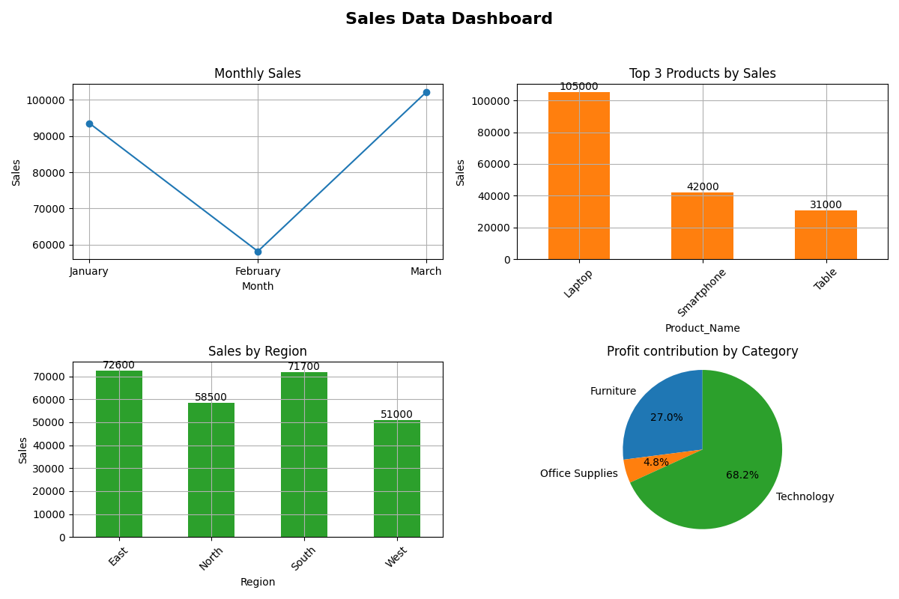

# 📊 Sales Data Dashboard

## 📌 Overview
This project analyzes sales data using Python and visualizes key business insights using a dashboard.

## 🔍 Key Insights
- 📈 Highest Sales Month: March
- 💻 Top Product: Laptop
- 🌍 Top Region: East
- 💰 Most Profitable Category: Technology

## 🛠 Tools Used
- Python
- Pandas
- Matplotlib

## 📊 Visualizations
- Monthly Sales Trend (Line Chart)
- Top Products (Bar Chart)
- Sales by Region (Bar Chart)
- Profit Distribution (Pie Chart)

## 🖼 Output
